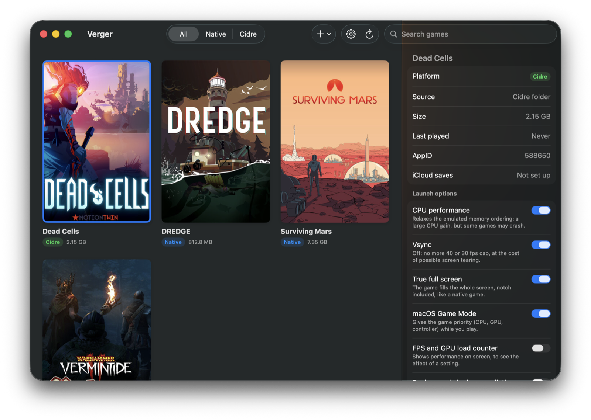

# Verger

**The game library for Apple Silicon Macs that runs your Windows games.** Verger installs, tunes and launches your games — the ones on your Steam account and the others — without ever opening a Terminal.

[Verger's website](https://gtranche.github.io/verger/en/) · [Version française](README.md) · [Download the latest version](https://github.com/gtranche/verger/releases/latest)



Verger is the interface. The engine is called [Cidre](https://github.com/gtranche/cidre): FEX, Wine, DXVK and KosmicKrisp put together to run Windows games as native arm64, without Rosetta. Verger installs Cidre and keeps it up to date on its own; there is nothing else to install.

## Install

You need an Apple Silicon Mac running **macOS 26 (Tahoe)** or later, and a Steam account. No Homebrew, no Terminal.

1. **Install the Steam client and sign in.** Download it from [store.steampowered.com/about](https://store.steampowered.com/about/), open it and sign in to your account. Verger relies on it to launch your Steam games and to know your library.
2. **Download Verger.** Get `Verger.zip` from the [latest release](https://github.com/gtranche/verger/releases/latest), unzip it and drag Verger into Applications.
3. **Open it with right-click → Open** the first time: the app is not notarized by Apple, so a double-click would be refused.
4. **Let Verger install Cidre.** It offers to install the engine (about 400 MB): accept. It downloads it, sets it up, and installs SteamCMD, Valve's tool that downloads games.
5. **Sign in to Steam in Verger**: **+** button, "Sign In to Steam…". This sign-in is separate from the Steam client's: it is used to read your library and download your games. Once only, it is remembered.
6. **Install a game**: **+** button, "Install a Steam Game…", then double-click its cover to play.

If something is missing (no Steam client, SteamCMD not installed), Verger shows it at the top of the library with the button to fix it. The status of each part is in Settings → Cidre.

## What Verger does

### One library, all your games

Your native games and your Windows games in one place, with their cover art. Click a card to open its panel, double-click to launch the game.

- **Install a Steam game** from your account: Verger lists the ones that are not installed. The Windows version is downloaded through Cidre, with progress; when a macOS version exists, it is offered first.
- **Add a non-Steam game**: choose its `.exe` and it joins the library. An installer (GOG, itch…) can be run from Verger too.
- **Game updates**: a game that is behind the latest published build is tagged "Update".
- **Saves on iCloud**: a Windows game's panel says where its copy stands (up to date, to back up, newer on iCloud) and lets you update it or take it back. Cidre also does it on its own, when the game launches and when you quit. For a game it does not know, you point it to the saves folder.
- **Report a problem**: from a game's panel or an error message, Verger prepares a GitHub issue with the versions, the options and the end of the log, stripped of what identifies you. You read it over and you are the one who sends it.
- **Your running game on Discord** (optional): with its name and icon, as on Windows. Discord does not recognise on its own a Windows game running on a Mac.
- **Cover art**: Steam's, or yours — an image of your own, or a search in [SteamGridDB](https://www.steamgriddb.com/) (free key), including for non-Steam games.

### Launch options you can read

Each option says what it gains and what it risks: CPU performance, vsync, true full screen, macOS Game Mode, Steam overlay, game language, performance counter, background shader compilation.

Three levels, weakest to strongest: what Cidre ships for a game, your **general settings**, and what you **force for one game** in its panel. A dot marks what you set yourself; one click gives it up.

### Everything is set from the app

- **Cidre**: its version, the status of each part, its update.
- **Steam**: sign in, sign out, switch account. Verger passes your password to SteamCMD, Valve's tool, and does not keep it.
- **Options**: the general launch settings.
- **Verger**: its language (French or English) and its own update, from GitHub.

## What Verger does not do (yet)

- **The Steam overlay is brand new.** Shift+Tab works in Steam games, but it has been tried on one game only so far; the "Steam overlay" option turns it off if a game displays badly.
- **No online play protected by Easy Anti-Cheat.** Some games offer a mode without anti-cheat (Vermintide 2's "Modded Realm"): that is the "Permissive anti-cheat" option.
- **Not every game runs.** Cidre is young; compatibility is checked game by game.
- **The app is not notarized**: hence right-click → Open on first launch.
- **Steam sign-in by password** (passed to SteamCMD), not by QR code yet.

## Build from source

You need the Swift tools (Command Line Tools or Xcode), nothing else.

```bash
Scripts/bundle.sh --open
```

builds `build/Verger.app` and opens it. Tests:

```bash
Scripts/test.sh
```

Interface texts are written in French in the code; their English translation lives in `Resources/en.lproj`. `Scripts/chaines.py` reports what is missing.

To publish a version, push a `vX.Y.Z` tag: GitHub Actions tests, builds `Verger.app` and attaches it to the release. That archive is what Verger downloads to update itself.

## How it is built

Verger contains no engine binary and reimplements none of it: it drives Cidre through its command line (`cidre list --json`, `cidre play`, `cidre set`…). Two repositories, one contract. The interface can be fixed ten times a day without anyone downloading a byte of Wine again.

The details — the full contract, the design choices, the progress — are in [docs/CONCEPTION.md](docs/CONCEPTION.md) (in French).
