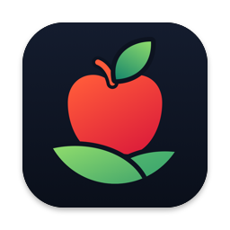
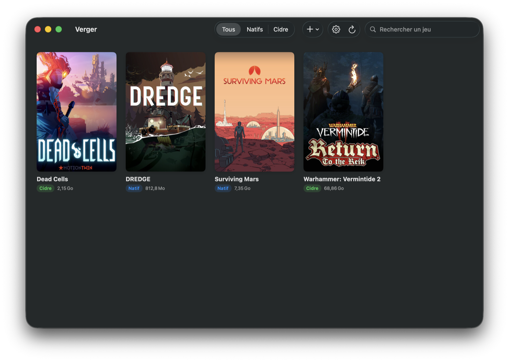
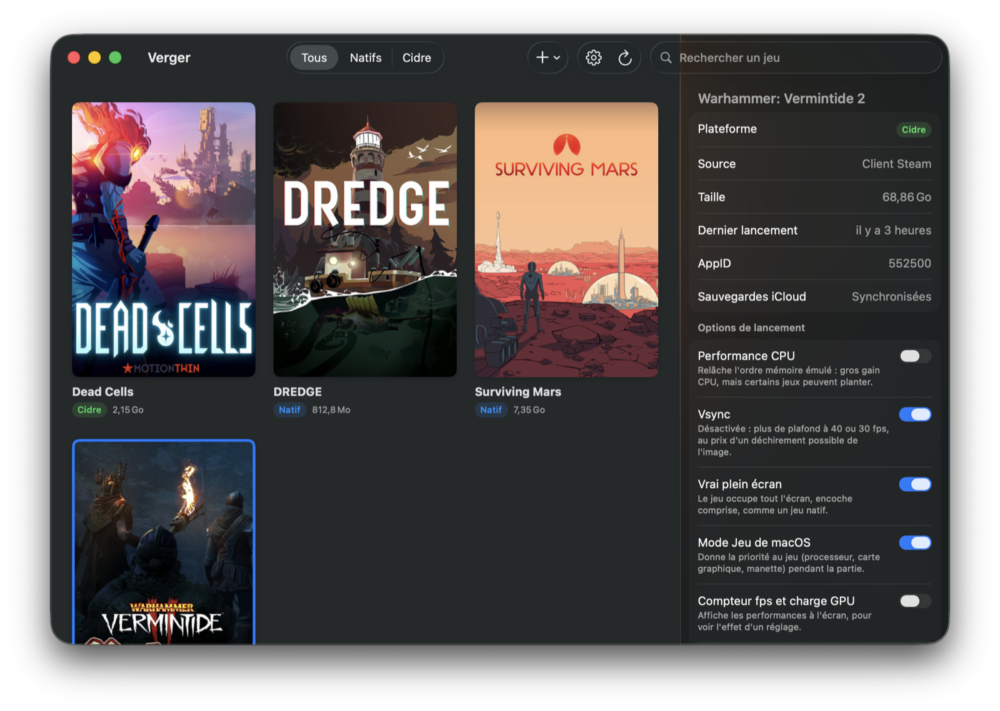
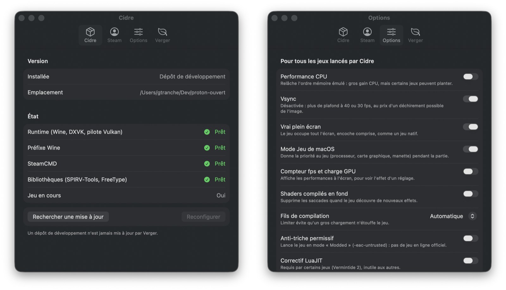

# Verger

**La bibliothèque de jeux pour Mac Apple Silicon qui fait tourner tes jeux Windows.** Verger installe, règle et lance tes jeux — ceux de ton compte Steam comme les autres — sans jamais ouvrir un Terminal.

[Site de Verger](https://gtranche.github.io/verger/) · [English version](README.en.md) · [Télécharger la dernière version](https://github.com/gtranche/verger/releases/latest)



Verger est l'interface. Le moteur s'appelle [Cidre](https://github.com/gtranche/cidre) : FEX, Wine, DXVK et KosmicKrisp assemblés pour faire tourner des jeux Windows en arm64 natif, sans Rosetta. Verger installe Cidre et le tient à jour tout seul ; tu n'as rien d'autre à installer.

## Installer

1. Télécharge `Verger.zip` depuis la [dernière version](https://github.com/gtranche/verger/releases/latest) et décompresse-le.
2. Ouvre Verger par **clic droit → Ouvrir** la première fois : l'application n'est pas notarisée par Apple, un double-clic serait refusé.
3. Verger propose d'installer Cidre (environ 400 Mo) : accepte, il s'occupe du reste.

Il faut un Mac Apple Silicon sous **macOS 26 (Tahoe)** ou plus récent, et le client Steam pour les jeux Steam.

## Ce que fait Verger

### Une bibliothèque, tous tes jeux

Tes jeux natifs et tes jeux Windows au même endroit, avec leurs jaquettes. Un clic sur une carte ouvre sa fiche, un double-clic lance le jeu.

- **Installer un jeu Steam** de ton compte : Verger liste ceux qui ne sont pas installés. La version Windows se télécharge par Cidre, avec son avancement ; quand une version macOS existe, c'est elle qui est proposée d'abord.
- **Ajouter un jeu non-Steam** : choisis son `.exe`, il entre dans la bibliothèque. Un installeur (GOG, itch…) se lance aussi depuis Verger.
- **Mises à jour des jeux** : un jeu en retard sur la dernière version publiée porte l'étiquette « Mise à jour ».
- **Sauvegardes sur iCloud** : la fiche d'un jeu Windows dit où en est sa copie (à jour, à sauvegarder, plus récente sur iCloud) et permet de la mettre à jour ou de la reprendre. Cidre le fait aussi tout seul, au lancement et à la sortie du jeu. Pour un jeu qu'il ne connaît pas, tu lui indiques le dossier des sauvegardes.
- **Signaler un problème** : depuis la fiche d'un jeu ou un message d'erreur, Verger prépare un incident GitHub avec les versions, les options et la fin du journal, débarrassés de ce qui t'identifie. Tu le relis et c'est toi qui l'envoies.
- **Ton jeu en cours sur Discord** (en option) : avec son nom et son icône, comme sur Windows. Discord ne reconnaît pas tout seul un jeu Windows qui tourne sur Mac.
- **Jaquettes** : celles de Steam, ou celles que tu choisis — une image à toi, ou une recherche dans [SteamGridDB](https://www.steamgriddb.com/) (clé gratuite), y compris pour les jeux non-Steam.

### Des options de lancement lisibles



Chaque option dit ce qu'elle fait gagner et ce qu'elle risque : performance CPU, vsync, vrai plein écran, Mode Jeu de macOS, overlay Steam, langue du jeu, compteur de performances, compilation des shaders en fond.

Trois niveaux, du plus faible au plus fort : ce que Cidre livre pour un jeu, tes **réglages généraux**, et ce que tu **forces pour un jeu** dans sa fiche. Une pastille marque ce que tu as réglé toi-même ; un clic y renonce.

### Tout se règle dans l'application



- **Cidre** : sa version, l'état de chaque pièce, sa mise à jour.
- **Steam** : se connecter, se déconnecter, changer de compte. Verger relaie ton mot de passe à SteamCMD, l'outil de Valve, et ne le garde pas.
- **Options** : les réglages généraux de lancement.
- **Verger** : sa langue (français ou anglais) et sa propre mise à jour, depuis GitHub.

## Ce que Verger ne fait pas (encore)

- **L'overlay Steam est tout neuf.** Maj+Tab fonctionne dans les jeux Steam, mais il n'a été essayé que sur un seul jeu pour l'instant ; l'option « Overlay Steam » le coupe si un jeu s'affiche mal.
- **Pas de jeu en ligne protégé par Easy Anti-Cheat.** Certains jeux proposent un mode sans anti-triche (le « Modded Realm » de Vermintide 2) : c'est l'option « Anti-triche permissif ».
- **Tous les jeux ne tournent pas.** Cidre est jeune ; la compatibilité se vérifie jeu par jeu.
- **Application non notarisée** : d'où le clic droit → Ouvrir au premier lancement.
- **Connexion Steam par mot de passe** (relayé à SteamCMD), pas encore par QR code.

## Construire depuis les sources

Il faut les outils Swift (Command Line Tools ou Xcode), rien d'autre.

```bash
Scripts/bundle.sh --open
```

construit `build/Verger.app` et l'ouvre. Les tests :

```bash
Scripts/test.sh
```

Les textes de l'interface sont écrits en français dans le code ; leur traduction anglaise est dans `Resources/en.lproj`. `Scripts/chaines.py` dit ce qui manque.

Pour publier une version, pousse un tag `vX.Y.Z` : GitHub Actions teste, construit `Verger.app` et l'attache à la release. C'est cette archive que Verger télécharge pour se mettre à jour.

## Comment c'est fait

Verger ne contient aucun binaire du moteur et n'en réimplémente rien : il pilote Cidre par sa ligne de commande (`cidre list --json`, `cidre play`, `cidre set`…). Deux dépôts, un contrat. On corrige l'interface dix fois par jour sans que personne ne retélécharge un octet de Wine.

Le détail — le contrat complet, les choix de conception, l'état d'avancement — est dans [docs/CONCEPTION.md](docs/CONCEPTION.md).
